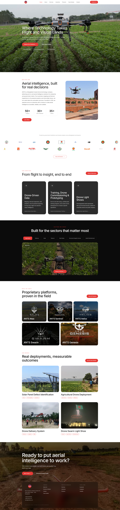
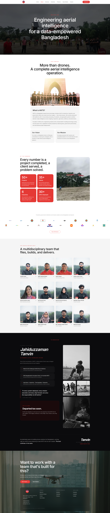
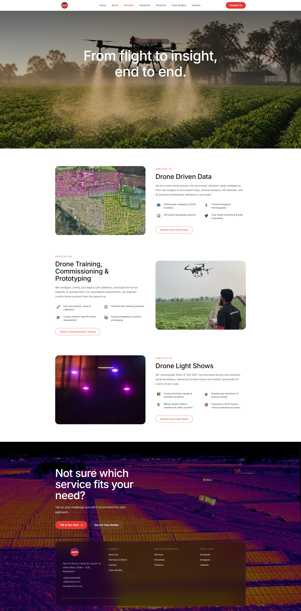
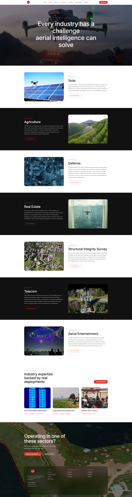
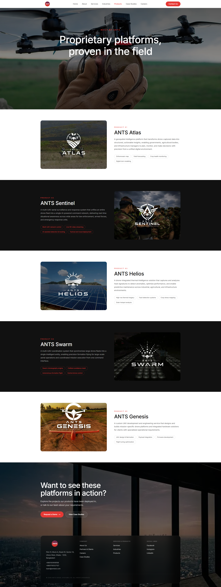
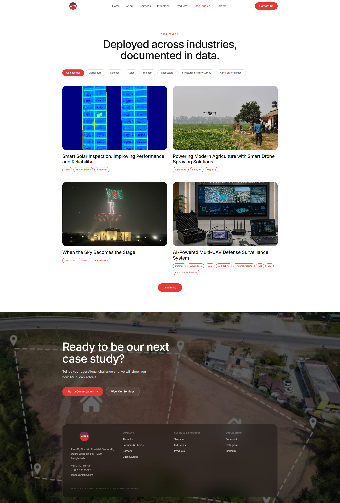

# ANTS Website - Marketing & Corporate Platform

This is the marketing platform for ANTS. It showcases their services, industries, products, case studies, and career options. We built this web application to be fast for users. It is also easy for content editors to manage.

## Showcase

Here is a look at the platform:

### Homepage


### About Us


### Services


### Industries


### Products


### Case Studies


---

## Tech Stack

We used modern web tools to ensure good performance and SEO:
- **[Next.js](https://nextjs.org)**: Used for Server-Side Rendering (SSR) and fast page loads.
- **[Storyblok CMS](https://www.storyblok.com/)**: A headless CMS. It allows the marketing team to edit content without changing code.
- **[Tailwind CSS](https://tailwindcss.com/)**: Used for quick and responsive styling.
- **[Resend](https://resend.com/)**: Used for sending emails reliably.

## Getting Started Locally

Follow these steps to run the project on your computer:

1. **Install dependencies:**
   ```bash
   npm install
   ```

2. **Set up the environment:**
   Create a `.env.local` file in the root folder. Add your Storyblok token:
   ```bash
   NEXT_PUBLIC_STORYBLOK_TOKEN=your_storyblok_preview_token
   ```

3. **Start the server:**
   ```bash
   npm run dev
   ```
   Open [http://localhost:3000](http://localhost:3000) to view the site.

## Copyright and License

All rights reserved. 

The code, designs, and assets in this repository are the property of the repository owner and ANTS. You may not copy, reproduce, distribute, or use any part of this project without explicit written permission.

## Deployment

This app uses Next.js Server Components. It is hosted on Hostinger. 

You must deploy it as a Node.js process, not as static files. This allows the CMS content to load correctly. Make sure to set the environment variables (like `NEXT_PUBLIC_STORYBLOK_TOKEN`) before you run the production build (`npm run build`).

## Project Structure

- `app/`: Routes and pages.
- `components/`: Reusable UI sections.
- `lib/`: Storyblok integration and shared tools.
- `hooks/`: Shared React hooks.
- `public/`: Static images and assets.
